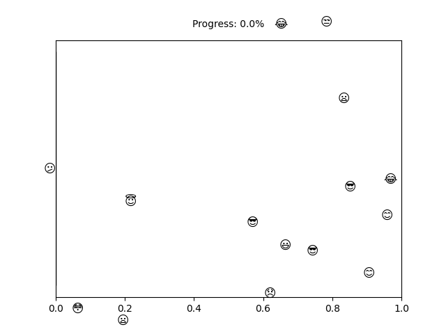

# PhD Thesis Progress Tracker

<td style="width: 10%; padding: 10px; border: none;">
      
</td>

## :calendar: Time Progress

- Today: 04/01/2024
- Contract Start Date: 21/11/2022
- Contract End Date: 20/11/2025

- Time Spent: 410 days
- Time Left: 686 days
- Completion: <b>37.41%</b>
- Progress: [#####################################---------------------------------------------------------------]

## 📈 Publications

| Project                                             | Submitted Date | Venue           | Status         | Note   |
|-----------------------------------------------------|----------------|-----------------|----------------|--------|
| [:ring: Élagage efficace des filtres basé sur les décompositions tensorielles](https://www.gretsi.fr/data/colloque/pdf/2023_pham1312.pdf) | 16/04/2023     | [GRETSI'23](https://gretsi.fr/colloque2023/)       | Accepted       |        |
| [:stars: Enhanced network compression through tensor decompositions and pruning](https://github.com/pvtien96/NORTON)        | 26/07/2023     | [TNNLS](https://ieeexplore.ieee.org/xpl/RecentIssue.jsp?punumber=5962385)           | Under Review   |        |
| [:ring: Efficient tensor decomposition-based filter pruning](https://github.com/pvtien96/CORING)        | 12/10/2023     | [Neural Networks](https://www.sciencedirect.com/journal/neural-networks) | Under Review   |        |
| to be continued ...                                 |                |                 |                |        |

---

Feel free to use this oh-so-fab template 🌈✨🎨 If this brought a 😊 to your face, consider sprinkling a ⭐️ on it. Happy coding! 🚀
